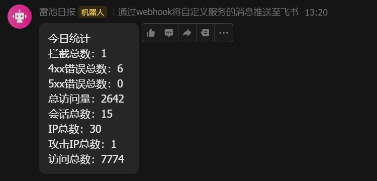

# Safeline Daily Report to Feishu

本工具通过 GitHub Actions，每日自动从长亭雷池 WAF (Safeline) 获取安全统计数据，并生成图文并茂的报告推送到飞书群组，帮助您轻松掌握网站的安全状况。

## ✨ 功能特性

- **🚀 自动化报告**：每日定时执行，自动获取最新的 WAF 数据并发送报告，无需人工干预。
- **📊 多维度统计**：全面覆盖访问、攻击、错误等多维度数据，提供详尽的安全分析。
- **🤖 飞书深度集成**：利用飞书卡片消息，提供结构化、可视化的报告，美观且易于阅读。
- **🔧 灵活配置**：支持通过 GitHub Secrets 进行简单配置，快速部署。
- **🕒 智能时区处理**：自动处理 UTC 与北京时间的转换，确保报告时间的准确性。
- **📖 开源免费**：完全开源，可自由部署和修改，是对雷池社区版功能的有力补充。

## 🚀 快速开始

### 1. 前置要求

- 一个可以运行 GitHub Actions 的 GitHub 仓库。
- 一个正在运行的雷池 WAF 实例（社区版或企业版均可）。
- 一个飞书群组以及添加自定义机器人的权限。

### 2. 部署步骤

1. **Fork 本仓库**：点击仓库右上角的 "Fork" 按钮，将本仓库复制到您自己的 GitHub 账户下。
2. **配置 Secrets**：
   - 在您 Fork 的仓库中，进入 `Settings` -> `Secrets and variables` -> `Actions`。
   - 点击 `New repository secret`，添加以下三个密钥：
     - `WAF_HOST`：您的雷池 WAF 访问地址，**必须包含协议和端口**，例如 `https://waf.yourdomain.com:9443`。
     - `WAF_TOKEN`：从雷池 WAF 后台获取的 API 访问令牌。
     - `FEISHU_URL`：您的飞书机器人 Webhook 地址。
3. **启用 Actions**：
   - 进入仓库的 `Actions` 标签页。
   - 如果有提示，请点击 "I understand my workflows, go ahead and enable them" 按钮，启用 GitHub Actions。

### 3. 验证部署

- **自动执行**：部署完成后，工作流将根据预设的 `cron` 表达式（默认为每日 UTC 23:59，即北京时间次日 07:59）自动执行。
- **手动触发**：您也可以通过向 `main` 分支推送一次提交来立即触发工作流，以验证配置是否正确。

## ⚙️ 详细配置

### 获取雷池 WAF API Token

1. 登录您的雷池 WAF 管理后台。
2. 导航至 `系统设置` -> `API 管理`。
3. 点击 `新建 Token`，为您的 Token 设置一个描述性名称（例如 `FeishuReport`）。
4. 复制生成的一长串 Token 字符串，并将其配置到 GitHub Secrets 的 `WAF_TOKEN` 中。

### 配置飞书机器人

1. 在您的飞书群组中，点击右上角的 `...` -> `设置` -> `机器人`。
2. 点击 `添加机器人`，选择 `自定义机器人`。
3. 为机器人设置一个名称和描述，然后复制生成的 Webhook 地址。
4. 将此地址配置到 GitHub Secrets 的 `FEISHU_URL` 中。

## 📊 数据指标说明

每日报告包含以下关键数据指标：

### 访问统计

- **总访问量 (PV)**：在统计周期内，网站被访问的总次数。
- **独立IP数 (UV)**：在统计周期内，访问网站的独立客户端 IP 地址总数。

### 安全防护

- **拦截总数**：WAF 成功拦截的攻击请求总数。
- **攻击IP数**：发起攻击的独立客户端 IP 地址总数。
- **速率限制**：因触发速率限制规则而被拦截的请求数。
- **人机挑战**：触发人机识别挑战（如验证码）的请求数。
- **离线封禁**：被 WAF 离线封禁的请求数。

### 错误统计

- **4xx 错误数**：客户端错误（如 404 Not Found, 403 Forbidden）的总数。
- **5xx 错误数**：服务器端错误（如 500 Internal Server Error, 502 Bad Gateway）的总数。

## 💡 使用指南

### 定时任务

- **执行时间**：工作流默认在每天 `UTC 23:59` 执行，对应 **北京时间次日早上 07:59**。
- **统计周期**：报告统计的是过去 24 小时的数据。
- **修改时间**：您可以修改 `.github/workflows/safeline_daily_report.yaml` 文件中的 `cron` 表达式来调整执行时间。

### 手动触发

如果您想立即生成一份报告，可以通过以下任一方式手动触发：

1. **Push 触发**：向 `main` 分支推送任何提交。
2. **Actions 页面触发**：
   - 进入仓库的 `Actions` 标签页。
   - 在左侧选择 `Safeline Daily Report` 工作流。
   - 点击 `Run workflow` -> `Run workflow`。

## ❓ 故障排查

- **收不到报告**：
  1. 检查 GitHub Actions 的运行日志，确认工作流是否成功执行。
  2. 验证 `FEISHU_URL` 是否正确且未过期。
  3. 检查雷池 WAF 的 API 是否可访问，以及 `WAF_HOST` 和 `WAF_TOKEN` 是否正确。
- **数据为 0**：
  1. 检查雷池 WAF 是否有流量通过。
  2. 确认 API Token 是否有读取统计数据的权限。

## 🤝 贡献

欢迎提交 Pull Request 或 Issue 来改进这个项目。

## 📄 开源许可

[MIT](./LICENSE)